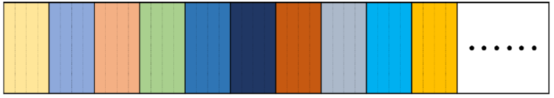
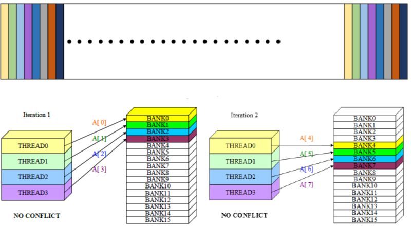

# Fast Fourier Transform Implementation with CUDA
Fast fourier transform (FFT) is a popular mechanism in digital signal processing. It utilized Cooley-Tukey algorithm to recursively split computation procedure in discrete fourier transform (DFT), therefore obtaining a faster calculation result. In case that there were plenty of computation requiring to be processed in parallel, I attempted to adopt CUDA to further accelerate this transform. In this project, two data decomposition strategies were performed and compared, respectively sequential block alignment and distributed block alignment. Comparison about tranform efficiency was subsequently conducted. 

## Data Preprocessing
Firstly transpose the audio file into complex arrays and normalized them with 32-bit scale (2 bits for channels and 16 bits for audio depth). Apply hamming window to avoid information lost. Process the complex array to do bit-reverse for fulfilling the requirement implementing FFT.

## FFT
Apply crossing transform between nodes (bits in data) based on FFT algorithm. This could be completed in two seperate operations beforehand to leverage the speed. Eventually store them to visualize the data.

## CUDA
Invoke GPU kernel to help processing tasks in parallel. Some complex libraries do not support in CUDA. User should export needed functions from C/C++ library and modify some variables in VS studio to successfully execute the code. Check out BeforeUse.txt for thorough explanations.

### Sequential Block Alignment
Threads are aligned with sequential blocks showing in the graph. It is an easy implementation, but probably causes unbalanced loading.  
  

### Distributed Block Alignment
Threads are aligned with banks, which are the entries of blocks. It resolves the unbalanced loading problem to make processing unit execute tasks more evenly.  
  

## File Description
- kernel.cu -> main file processing audio file and perform FFT
- FFT_GPU_method1.cu -> include GPU kernel and the first data decomposition method
- FFT_GPU_method2.cu -> include GPU kernel and the second data decomposition method
- parameters.h -> set up parameters and save indexes

*Demo Video Link: https://drive.google.com/file/d/1CBYk9r32ZlfXzfkpuqr153wWZbMJPLxa/view?usp=sharing*

## Contact Info
Author: Chun-Sheng Wu, MS student in Computer Engineering @ Texas A&M University  
Email: jinsonwu@tamu.edu  
LinkedIn: https://www.linkedin.com/in/chunshengwu/
